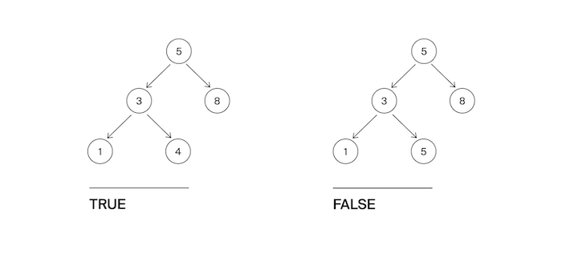
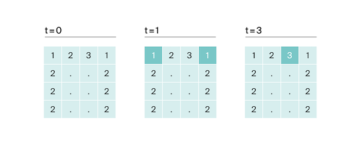

[![Dependencies][dependency-shield]][dependency-url]
[![LinkedIn][linkedin-shield]][linkedin-url]

# Algorithms

Algorithmic tasks in Python

---

### Built With

[![Python][Python.io]][Python-url]

## 1. Introduction to Algorithms

[contest.yandex.ru](https://contest.yandex.ru/contest/23389/problems/)

---

<b>Function value (<a href="introduction_to_algorithms/function_value.py">function_value.py</a>)</b>

#### Description

Vasya is doing a math test: he calculates the value of functions at various points. The weather is fine, and friends
invite Vasya to go for a walk. But the boy decided to finish the test first and only after that go to his friends.
Unfortunately, Vasya does not know how to program yet. But you know how. Help Vasya write the code for the function that
calculates y = ax2 + bx + c. Write a program that will use the coefficients a, b, c and the number x to display the
value of the function at the point x.

#### Enter form

Integers a, x, b, c are given as input separated by a space. At the end of the input is a line break.

#### Expected output

Print one number — the value of the function at the point x.

#### Example

Enter: -8 -5 -2 7
Output: -183

------

<b>Even and odd numbers (<a href="introduction_to_algorithms/even_odd.py">even_odd.py</a>)</b>

#### Description

Imagine an online subway game where the player presses a button and three random numbers appear on the screen. If all
three numbers are of the same parity, the player wins.

Write a program that uses three numbers to determine whether a player has won or not.

#### Enter form

The first line contains three random integers a, b and c. Numbers do not exceed 109 modulo.

#### Expected output

Print "WIN" if the player won, and "FAIL" otherwise.

#### Example

Enter: 7 11 7
Output: WIN

------

<b>Neighbors (<a href="introduction_to_algorithms/neighbors.py">neighbors.py</a>)</b>

#### Description

Given a matrix. You need to write a function that for an element returns all of its neighbors. A neighbor is an element
that is one cell away from the current one to the left, right, up, or down. Diagonal elements are not considered
adjacent.

For example, in matrix A, neighboring elements for (0, 0) will be 2 and 0. And for (2, 1) - 1, 2, 7, 7.

#### Enter form

The first line contains n — the number of matrix rows. In the second - the number of columns m. The numbers m and n do
not exceed 1000. The next n lines contain a matrix. The elements of the matrix are integers, modulo not exceeding 1000.
The last two lines contain the coordinates of the element whose neighbors are to be found. Indexing starts from zero.

#### Expected output

Type the numbers you need in ascending order, separated by a space.

#### Example

Enter:  
4  
3  
1 2 3  
0 2 6  
7 4 1  
2 7 0  
3  
0

Output: 7 7

------

<b>Random weather (<a href="introduction_to_algorithms/weather.py">weather.py</a>)</b>

#### Description

Your city's weather service has decided to explore the weather in a new way.

Under the air temperature on a particular day, we mean the maximum temperature on that day.

Under the randomness of the weather for n days, the service understands the number of days in which the temperature is
strictly higher than the day before (if such exists) and on the day after the current one (if such exists). For example,
if for 5 days the maximum air temperature was [1, 2, 5, 4, 8] degrees, then the randomness for this period is 2: the
described conditions were fulfilled on the 3rd and 5th days.

Determine the chaotic weather for this period from daily temperature readings.

Note that if the number of readings is n=1, then the only day will be chaotic.

#### Enter form

The first line contains an integer n, the length of the measurement period in days, 1 ≤ n≤ 105. The second line contains
n integers, the temperature values on each of the n days. Temperature values do not exceed 273 modulo.

#### Expected output

Print a single number — randomness for the given period.

#### Example

Enter:  
7  
-1 -10 -8 0 2 0 5

Output: 3

------

<b>Longest word (<a href="introduction_to_algorithms/longest.py">longest.py</a>)</b>

#### Description

To prepare for the seminar, Gaucher should read an article on effective management. Since Gosha wants to plan the day in
advance, he needs to estimate the complexity of the article.

He came up with this evaluation method: a random sentence is taken from the text and the longest word is searched for in
it. Its length will be the conditional complexity of the article.

Help Gosha cope with this task.

#### Enter form

The first line contains the text length L (1 ≤ L ≤ 105).

The next line contains text consisting of lowercase Latin letters and spaces. A word is a sequence of letters not
separated by spaces. Spaces can be at the very beginning of the line and at the very end of it. The text ends with a
line break, this character is not included in the number of other L characters.

#### Expected output

In the first line print the longest word. In the second line print its length. If there are several suitable words,
print the one that occurs first.

#### Example

Enter:  
19  
i love segment tree

Output:  
segment  
7

------

<b>Palindrome (<a href="introduction_to_algorithms/palindrome.py">palindrome.py</a>)</b>

#### Description

Help Vasya understand if the phrase will be a palindrome‎. Only letters and numbers are counted, uppercase and lowercase
letters are considered the same.

The solution should run in O(N), where N is the length of the input string.

#### Enter form

A single line contains a phrase or a word. Letters can only be Latin. The length of the text does not exceed 20,000
characters.

The phrase can consist of lowercase and uppercase Latin letters, numbers, punctuation marks.

#### Expected output

Print "True" if the phrase is a palindrome, and "False" if it is not.

#### Example

Enter: A man, a plan, a canal: Panama

Output: True

------

<b>Work home (<a href="introduction_to_algorithms/home.py">home.py</a>)</b>

#### Description

Vasya has implemented a function that converts an integer from decimal to binary. But it doesn't seem to work out very
well.

Try to write a more efficient program.

Do not use the built-in language tools for converting numbers into binary representation.

#### Enter form

The input is an integer in the range from 0 to 10000.

#### Expected output

Print the binary representation of this number.

#### Example

Enter: 5

Output: 101

------

<b>Binary system (<a href="introduction_to_algorithms/binary.py">binary.py</a>)</b>

#### Description

Timothy wrote down two numbers in the binary system and asked Gosha to print their sum, also in the binary system. The
ability to add binary numbers built into the programming language cannot be used. Help Gosha solve the problem.

The solution should run in O(N), where N is the number of digits of the maximum number in the input.

#### Enter form

Two numbers in binary notation, each on a separate line. The length of each number does not exceed 10,000 characters.

#### Expected output

One number in the binary system.

#### Example

Enter:  
1010  
1011

Output: 10101

------

<b>Power of four (<a href="introduction_to_algorithms/four.py">four.py</a>)</b>

#### Description

Write a program that determines whether a positive integer is a power of 4.

Hint: the power of four will be all numbers of the form 4n, where n is a non-negative integer.

#### Enter form

The input is an integer in the range from 1 to 10000.

#### Expected output

Print "True" if the number is a power of four, "False" otherwise.

#### Example

Enter: 15

Output: False

------

<b>Factorization (<a href="introduction_to_algorithms/factorization.py">factorization.py</a>)</b>

#### Description

The fundamental theorem of arithmetic says: any number can be decomposed into a product of prime factors in a unique
way, up to their permutation. For example:

The number 8 can be represented as 2 × 2 × 2.
The number 50 is like 2 x 5 x 5 (or 5 x 5 x 2, or 5 x 2 x 5). The three variants differ only in the order of the
multipliers.
Factoring a number into prime factors is called factoring a number.

Write a program that factorizes the given number.

#### Enter form

The single line contains the number n (2 ≤ n ≤ 109) to be factorized.

#### Expected output

Print, in non-decreasing order, the prime factors into which the number n is decomposed.

#### Example

Enter: 100

Output: 2 2 5 5

------

<b>List form (<a href="introduction_to_algorithms/list_form.py">list_form.py</a>)</b>

#### Description

Vasya asked Alla to help solve the problem. This time in informatics.

For a non-negative integer X, the list form is an array of its digits from left to right. For example, for 1231 the list
form would be [1,2,3,1]. The input is the number of digits of the number X, the list form of the non-negative number X
and the non-negative number K. The number K does not exceed 10000. The length of the number X does not exceed 1000.

We need to return the list form of the number X + K.

#### Enter form

The first line contains the length of the list form of the number X. The next line contains the list form itself with
digits separated by a space.

The last line contains the number K, 0 ≤ K ≤ 10000.

#### Expected output

Output the list form of the number X+K.

#### Example

Enter:  
4  
1 2 0 0  
34

Output: 1 2 3 4

------

<b>Extra letter (<a href="introduction_to_algorithms/extra_letter.py">extra_letter.py</a>)</b>

#### Description

Vasya really likes problems about strings, so he came up with his own. There are 2 strings s and t, consisting only of
lowercase letters. The string t is obtained by mixing the letters of the string s and adding 1 letter at a random
position. You need to find the added letter.

#### Enter form

The input is strings s and t, separated by a line break. Line lengths do not exceed 1000 characters. Lines are not
empty.

#### Expected output

Print the extra letter.

#### Example

Enter:  
abcd  
abcde

Output: e

------

## 2. Introduction to Algorithms final tasks

[contest.yandex.ru](https://contest.yandex.ru/contest/23390/problems/)

---

<b>Nearest zero (<a href="introduction_to_algorithms_final_tasks/zero.py">zero.py</a>)</b>

#### Description

Timothy is looking for a place to build a house for himself. The street he wants to live on has length n, that is, it
consists of n identical consecutive sections. Each plot is either empty or a house has already been built on it.

Sociable Timothy does not want to live far from other people on this street. Therefore, it is important for him to know
for each site the distance to the nearest empty site. If the plot is empty, this value will be equal to zero - the
distance to itself.

Help Timofey calculate the required distances. For this you have a street map. Houses in the city of Timothy were
numbered in the order in which they were built, so their numbers on the map are not ordered in any way. Empty areas are
marked with zeros.

#### Enter form

The first line contains the length of the street —– n (1 ≤ n ≤ 106). The next line contains n non-negative integers —
the numbers of houses and designations of empty plots on the map (zeroes). It is guaranteed that there is at least one
zero in the sequence. House numbers (positive numbers) are unique and do not exceed 109.

#### Expected output

For each segment, print the distance to the nearest zero. Output the numbers on one line, separating them with spaces.

#### Example

Enter:  
5  
0 1 4 9 0

Output: 0 1 2 1 0

------

<b>Sleight of hand (<a href="introduction_to_algorithms_final_tasks/hands.py">hands.py</a>)</b>

#### Description

The game "Speed typing simulator" is a field of 4x4 keys. In it, at each round, a configuration of numbers and points
appears. Either a dot or a number from 1 to 9 is written on the key.

At time t, the player must simultaneously press all the keys on which the number t is written. Gosha and Timofey can
press k keys each at the same time. If at time t all the necessary keys are pressed, then the players get 1 point.

Find the number of points that Gosha and Timofey can earn if they press the keys together.

#### Enter form

The first line contains an integer k (1 ≤ k ≤ 5).

In the next four lines, the type of the simulator is specified - 4 characters in each line. Each character is either a
dot or a number from 1 to 9. The characters on the same line are consecutive and are not separated by spaces.

#### Expected output

Print a single number, the maximum number of points that Gosha and Timofey can get.

#### Example

Enter:  
2  
1231  
2..2  
2..2  
2..2

Output: 2

------

## 3. Basic data structures

[contest.yandex.ru](https://contest.yandex.ru/contest/23758/problems/)

---

<b>Task list (<a href="basic_data_structures/task_list.py">task_list.py</a>)</b>

#### Description

Vasya needs to print out his to-do list for today. Help him: write a function that prints all of his cases. It is known
that Vasya has no more than 5000 cases
Attention: in this task it is not necessary to read the input data. You only need to write a function that takes the
head of the list as input and prints its elements. The following is a description of a structure that defines a list
node.

#### Enter form

-||-

#### Expected output

The function should print the elements of the list, one per line.

------

<b>Unloves task (<a href="basic_data_structures/unloved_task.py">unloved_task.py</a>)</b>

#### Description

Vasya thinks about what he can not do from the to-do list that he has compiled. But it seems that all points are very
important! Vasya decides to think of a number and delete the case that goes under this number. The to-do list is
presented as a singly linked list. Write a solution function that takes as input the head of the list and the number of
the case to be deleted and returns the head of the updated list.

Attention: in this task it is not necessary to read the input data. You only need to write a function that takes as
input the head of the list and the number of the element to be removed and returns the head of the updated list.

#### Enter form

-||-

#### Expected output

Return the head of the list that has the desired element removed.

------

<b>Stack max(<a href="basic_data_structures/stack_max.py">stack_max.py</a>)</b>

#### Description

You need to implement a StackMax class that supports the operation of determining the maximum among all elements in the
stack. The class must support the operations push(x), where x is an integer, pop() and get_max().

#### Enter form

The first line contains one number n — the number of commands, which does not exceed 10000. The next n lines contain
commands. Commands can be of the following types:

push(x) - push the number x to the stack;
pop() - remove a number from the top of the stack;
get_max() - print the maximum number on the stack;
If the stack is empty, print "None" when calling the get_max() command, and "error" for the pop() command.

#### Expected output

For each get_max() command, print the result of its execution. If the stack is empty, print "None" for the get_max()
command. If there is a removal from an empty stack, print "error".

#### Example

Enter:  
8  
get_max  
push 7  
pop  
push -2  
push -1  
pop  
get_max  
get_max

Output:  
None  
-2  
-2

------

<!-- MARKDOWN LINKS & IMAGES -->

[dependency-shield]: https://img.shields.io/badge/Dependency_Graph-darkgreen?style=for-the-badge

[dependency-url]: https://github.com/Lesash13/api_python_app/network/dependencies

[linkedin-shield]: https://img.shields.io/badge/-LinkedIn-black.svg?style=for-the-badge&logo=linkedin&colorB=darkblue

[linkedin-url]: https://www.linkedin.com/in/victoriya-mitrofanova-96839278/

[Python.io]: https://img.shields.io/badge/-Python-yellow?style=for-the-badge&logo=python

[Python-url]: https://www.python.org/