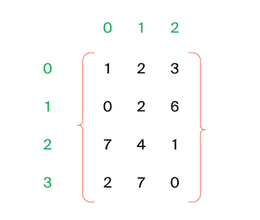
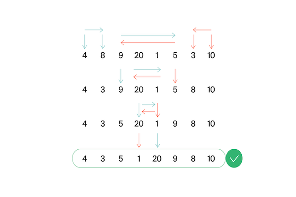

[![Dependencies][dependency-shield]][dependency-url]
[![LinkedIn][linkedin-shield]][linkedin-url]

# Algorithms

Algorithmic tasks in Python

---

### Built With

[![Python][Python.io]][Python-url]

## 1. Introduction to Algorithms

[contest.yandex.ru](https://contest.yandex.ru/contest/23389/problems/)

---

<b>Function value (<a href="introduction_to_algorithms/function_value.py">function_value.py</a>)</b>

#### Description

Vasya is doing a math test: he calculates the value of functions at various points. The weather is fine, and friends
invite Vasya to go for a walk. But the boy decided to finish the test first and only after that go to his friends.
Unfortunately, Vasya does not know how to program yet. But you know how. Help Vasya write the code for the function that
calculates y = ax2 + bx + c. Write a program that will use the coefficients a, b, c and the number x to display the
value of the function at the point x.

#### Enter form

Integers a, x, b, c are given as input separated by a space. At the end of the input is a line break.

#### Expected output

Print one number — the value of the function at the point x.

#### Example

Enter: -8 -5 -2 7
Output: -183

------

<b>Even and odd numbers (<a href="introduction_to_algorithms/even_odd.py">even_odd.py</a>)</b>

#### Description

Imagine an online subway game where the player presses a button and three random numbers appear on the screen. If all
three numbers are of the same parity, the player wins.

Write a program that uses three numbers to determine whether a player has won or not.

#### Enter form

The first line contains three random integers a, b and c. Numbers do not exceed 109 modulo.

#### Expected output

Print "WIN" if the player won, and "FAIL" otherwise.

#### Example

Enter: 7 11 7
Output: WIN

------

<b>Neighbors (<a href="introduction_to_algorithms/neighbors.py">neighbors.py</a>)</b>

#### Description

Given a matrix. You need to write a function that for an element returns all of its neighbors. A neighbor is an element
that is one cell away from the current one to the left, right, up, or down. Diagonal elements are not considered
adjacent.

For example, in matrix A, neighboring elements for (0, 0) will be 2 and 0. And for (2, 1) - 1, 2, 7, 7.

#### Enter form

The first line contains n — the number of matrix rows. In the second - the number of columns m. The numbers m and n do
not exceed 1000. The next n lines contain a matrix. The elements of the matrix are integers, modulo not exceeding 1000.
The last two lines contain the coordinates of the element whose neighbors are to be found. Indexing starts from zero.

#### Expected output

Type the numbers you need in ascending order, separated by a space.

#### Example

Enter:  
4  
3  
1 2 3  
0 2 6  
7 4 1  
2 7 0  
3  
0

Output: 7 7

------

<b>Random weather (<a href="introduction_to_algorithms/weather.py">weather.py</a>)</b>

#### Description

Your city's weather service has decided to explore the weather in a new way.

Under the air temperature on a particular day, we mean the maximum temperature on that day.

Under the randomness of the weather for n days, the service understands the number of days in which the temperature is
strictly higher than the day before (if such exists) and on the day after the current one (if such exists). For example,
if for 5 days the maximum air temperature was [1, 2, 5, 4, 8] degrees, then the randomness for this period is 2: the
described conditions were fulfilled on the 3rd and 5th days.

Determine the chaotic weather for this period from daily temperature readings.

Note that if the number of readings is n=1, then the only day will be chaotic.

#### Enter form

The first line contains an integer n, the length of the measurement period in days, 1 ≤ n≤ 105. The second line contains
n integers, the temperature values on each of the n days. Temperature values do not exceed 273 modulo.

#### Expected output

Print a single number — randomness for the given period.

#### Example

Enter:  
7  
-1 -10 -8 0 2 0 5

Output: 3

------

<b>Longest word (<a href="introduction_to_algorithms/longest.py">longest.py</a>)</b>

#### Description

To prepare for the seminar, Gaucher should read an article on effective management. Since Gosha wants to plan the day in
advance, he needs to estimate the complexity of the article.

He came up with this evaluation method: a random sentence is taken from the text and the longest word is searched for in
it. Its length will be the conditional complexity of the article.

Help Gosha cope with this task.

#### Enter form

The first line contains the text length L (1 ≤ L ≤ 105).

The next line contains text consisting of lowercase Latin letters and spaces. A word is a sequence of letters not
separated by spaces. Spaces can be at the very beginning of the line and at the very end of it. The text ends with a
line break, this character is not included in the number of other L characters.

#### Expected output

In the first line print the longest word. In the second line print its length. If there are several suitable words,
print the one that occurs first.

#### Example

Enter:  
19  
i love segment tree

Output:  
segment  
7

------

<b>Palindrome (<a href="introduction_to_algorithms/palindrome.py">palindrome.py</a>)</b>

#### Description

Help Vasya understand if the phrase will be a palindrome‎. Only letters and numbers are counted, uppercase and lowercase
letters are considered the same.

The solution should run in O(N), where N is the length of the input string.

#### Enter form

A single line contains a phrase or a word. Letters can only be Latin. The length of the text does not exceed 20,000
characters.

The phrase can consist of lowercase and uppercase Latin letters, numbers, punctuation marks.

#### Expected output

Print "True" if the phrase is a palindrome, and "False" if it is not.

#### Example

Enter: A man, a plan, a canal: Panama

Output: True

------

<b>Work home (<a href="introduction_to_algorithms/home.py">home.py</a>)</b>

#### Description

Vasya has implemented a function that converts an integer from decimal to binary. But it doesn't seem to work out very
well.

Try to write a more efficient program.

Do not use the built-in language tools for converting numbers into binary representation.

#### Enter form

The input is an integer in the range from 0 to 10000.

#### Expected output

Print the binary representation of this number.

#### Example

Enter: 5

Output: 101

------

<b>Binary system (<a href="introduction_to_algorithms/binary.py">binary.py</a>)</b>

#### Description

Timothy wrote down two numbers in the binary system and asked Gosha to print their sum, also in the binary system. The
ability to add binary numbers built into the programming language cannot be used. Help Gosha solve the problem.

The solution should run in O(N), where N is the number of digits of the maximum number in the input.

#### Enter form

Two numbers in binary notation, each on a separate line. The length of each number does not exceed 10,000 characters.

#### Expected output

One number in the binary system.

#### Example

Enter:  
1010  
1011

Output: 10101

------

<b>Power of four (<a href="introduction_to_algorithms/four.py">four.py</a>)</b>

#### Description

Write a program that determines whether a positive integer is a power of 4.

Hint: the power of four will be all numbers of the form 4n, where n is a non-negative integer.

#### Enter form

The input is an integer in the range from 1 to 10000.

#### Expected output

Print "True" if the number is a power of four, "False" otherwise.

#### Example

Enter: 15

Output: False

------

<b>Factorization (<a href="introduction_to_algorithms/factorization.py">factorization.py</a>)</b>

#### Description

The fundamental theorem of arithmetic says: any number can be decomposed into a product of prime factors in a unique
way, up to their permutation. For example:

The number 8 can be represented as 2 × 2 × 2.
The number 50 is like 2 x 5 x 5 (or 5 x 5 x 2, or 5 x 2 x 5). The three variants differ only in the order of the
multipliers.
Factoring a number into prime factors is called factoring a number.

Write a program that factorizes the given number.

#### Enter form

The single line contains the number n (2 ≤ n ≤ 109) to be factorized.

#### Expected output

Print, in non-decreasing order, the prime factors into which the number n is decomposed.

#### Example

Enter: 100

Output: 2 2 5 5

------

<b>List form (<a href="introduction_to_algorithms/list_form.py">list_form.py</a>)</b>

#### Description

Vasya asked Alla to help solve the problem. This time in informatics.

For a non-negative integer X, the list form is an array of its digits from left to right. For example, for 1231 the list
form would be [1,2,3,1]. The input is the number of digits of the number X, the list form of the non-negative number X
and the non-negative number K. The number K does not exceed 10000. The length of the number X does not exceed 1000.

We need to return the list form of the number X + K.

#### Enter form

The first line contains the length of the list form of the number X. The next line contains the list form itself with
digits separated by a space.

The last line contains the number K, 0 ≤ K ≤ 10000.

#### Expected output

Output the list form of the number X+K.

#### Example

Enter:  
4  
1 2 0 0  
34

Output: 1 2 3 4

------

<b>Extra letter (<a href="introduction_to_algorithms/extra_letter.py">extra_letter.py</a>)</b>

#### Description

Vasya really likes problems about strings, so he came up with his own. There are 2 strings s and t, consisting only of
lowercase letters. The string t is obtained by mixing the letters of the string s and adding 1 letter at a random
position. You need to find the added letter.

#### Enter form

The input is strings s and t, separated by a line break. Line lengths do not exceed 1000 characters. Lines are not
empty.

#### Expected output

Print the extra letter.

#### Example

Enter:  
abcd  
abcde

Output: e

------

## 2. Introduction to Algorithms final tasks

[contest.yandex.ru](https://contest.yandex.ru/contest/23390/problems/)

---

<b>Nearest zero (<a href="introduction_to_algorithms_final_tasks/zero.py">zero.py</a>)</b>

#### Description

Timothy is looking for a place to build a house for himself. The street he wants to live on has length n, that is, it
consists of n identical consecutive sections. Each plot is either empty or a house has already been built on it.

Sociable Timothy does not want to live far from other people on this street. Therefore, it is important for him to know
for each site the distance to the nearest empty site. If the plot is empty, this value will be equal to zero - the
distance to itself.

Help Timofey calculate the required distances. For this you have a street map. Houses in the city of Timothy were
numbered in the order in which they were built, so their numbers on the map are not ordered in any way. Empty areas are
marked with zeros.

#### Enter form

The first line contains the length of the street —– n (1 ≤ n ≤ 106). The next line contains n non-negative integers —
the numbers of houses and designations of empty plots on the map (zeroes). It is guaranteed that there is at least one
zero in the sequence. House numbers (positive numbers) are unique and do not exceed 109.

#### Expected output

For each segment, print the distance to the nearest zero. Output the numbers on one line, separating them with spaces.

#### Example

Enter:  
5  
0 1 4 9 0

Output: 0 1 2 1 0

------

<b>Sleight of hand (<a href="introduction_to_algorithms_final_tasks/hands.py">hands.py</a>)</b>

#### Description

The game "Speed typing simulator" is a field of 4x4 keys. In it, at each round, a configuration of numbers and points
appears. Either a dot or a number from 1 to 9 is written on the key.

At time t, the player must simultaneously press all the keys on which the number t is written. Gosha and Timofey can
press k keys each at the same time. If at time t all the necessary keys are pressed, then the players get 1 point.

Find the number of points that Gosha and Timofey can earn if they press the keys together.

#### Enter form

The first line contains an integer k (1 ≤ k ≤ 5).

In the next four lines, the type of the simulator is specified - 4 characters in each line. Each character is either a
dot or a number from 1 to 9. The characters on the same line are consecutive and are not separated by spaces.

#### Expected output

Print a single number, the maximum number of points that Gosha and Timofey can get.

#### Example

Enter:  
2  
1231  
2..2  
2..2  
2..2

Output: 2

------

## 3. Basic data structures

[contest.yandex.ru](https://contest.yandex.ru/contest/23758/problems/)

---

<b>Task list (<a href="basic_data_structures/task_list.py">task_list.py</a>)</b>

#### Description

Vasya needs to print out his to-do list for today. Help him: write a function that prints all of his cases. It is known
that Vasya has no more than 5000 cases
Attention: in this task it is not necessary to read the input data. You only need to write a function that takes the
head of the list as input and prints its elements. The following is a description of a structure that defines a list
node.

#### Enter form

-||-

#### Expected output

The function should print the elements of the list, one per line.

------

<b>Unloved task (<a href="basic_data_structures/unloved_task.py">unloved_task.py</a>)</b>

#### Description

Vasya thinks about what he can not do from the to-do list that he has compiled. But it seems that all points are very
important! Vasya decides to think of a number and delete the case that goes under this number. The to-do list is
presented as a singly linked list. Write a solution function that takes as input the head of the list and the number of
the case to be deleted and returns the head of the updated list.

Attention: in this task it is not necessary to read the input data. You only need to write a function that takes as
input the head of the list and the number of the element to be removed and returns the head of the updated list.

#### Enter form

-||-

#### Expected output

Return the head of the list that has the desired element removed.

------

<b>Careful mother (<a href="basic_data_structures/mother.py">mother.py</a>)</b>

#### Description

Vasya's mother wants to know what her son plans to do and when. Help her: write a solution function that determines the
index of the first occurrence of the value passed to it as input in the linked list, if the value is present.
Attention: in this task it is not necessary to read the input data. You only need to write a function that takes the
head of the list and the element you are looking for as input, and returns an integer - the index of the found element
or -1.

#### Enter form

The input function takes the head of a singly linked list and the element to be found. The list length does not exceed
10000 elements. The list is never empty.

#### Expected output

The function returns the index of the first occurrence of the searched element in the list (indexing starts from zero).
If the element is not found, -1 should be returned.

------

<b>Stack max(<a href="basic_data_structures/stack_max.py">stack_max.py</a>)</b>

#### Description

You need to implement a StackMax class that supports the operation of determining the maximum among all elements in the
stack. The class must support the operations push(x), where x is an integer, pop() and get_max().

#### Enter form

The first line contains one number n — the number of commands, which does not exceed 10000. The next n lines contain
commands. Commands can be of the following types:

push(x) - push the number x to the stack;
pop() - remove a number from the top of the stack;
get_max() - print the maximum number on the stack;
If the stack is empty, print "None" when calling the get_max() command, and "error" for the pop() command.

#### Expected output

For each get_max() command, print the result of its execution. If the stack is empty, print "None" for the get_max()
command. If there is a removal from an empty stack, print "error".

#### Example

Enter:  
8  
get_max  
push 7  
pop  
push -2  
push -1  
pop  
get_max  
get_max

Output:  
None  
-2  
-2

------

<b>Limited queue(<a href="basic_data_structures/limited_queue.py">limited_queue.py</a>)</b>

#### Description

Astrologers have announced a day of limited queues. Timofey needs to write a MyQueueSized class that takes a max_size
parameter, which means the maximum allowable number of elements in the queue.

Help him - implement a program that will emulate the operation of such a queue. The functions to be supported are
described in the input format.

#### Enter form

The first line contains one number — the number of commands, it does not exceed 5000.
The second line specifies the maximum allowable queue size, it does not exceed 5000.
The commands follow, one per line. Commands can be of the following types:

push(x) - add the number x to the queue;
pop() - remove a number from the queue and print;
peek() - print the first number in the queue;
size() - return the size of the queue;
If the allowed queue size is exceeded, "error" should be displayed. When calling the pop() or peek() operations on an
empty queue, output "None".

#### Expected output

Print the results of the desired commands, one per line.

#### Example

Enter:  
8  
2  
peek  
push 5  
push 2  
peek  
size  
size  
push 1  
size

Output:  
None  
5  
2  
2  
error  
2

------

<b>List queue(<a href="basic_data_structures/list_queue.py">list_queue.py</a>)</b>

#### Description

Timothy's favorite variant of a queue is a queue written using a linked list. Help him make it happen. The queue must
support the execution of three commands:

get() - get the element at the head of the queue and remove it. If the queue is empty, print "error".
put(x) - add the number x to the queue
size() - display the current size of the queue

#### Enter form

The first line contains the number of commands n — an integer not exceeding 1000. Each of the next n lines contains
commands one line at a time.

#### Expected output

Print the answer to each query, one per line.

#### Example

Enter:  
10  
put -34  
put -23  
get  
size  
get  
size  
get  
get  
put 80  
size

Output:  
-34  
1  
-23  
0  
error  
error  
1

------

<b>Fibonachhi(<a href="basic_data_structures/fibonachhi.py">fibonachhi.py</a>)</b>

#### Description

Timothy had n (0≤n≤32) trainees. Each trainee wanted to be better than their predecessors, so
the i-trainee made as many commits as the sum of the previous two trainees. The first two interns were less proactive -
they made one commit each.
Let Fi - number of commits made i-trainee (trainees are numbered from zero). Then the following is done:
F0=F1=1. For all i≥2 it will be Fi=F(i−1)+F(i−2).Determine how much code the next intern will write - find Fn.
The solution must be implemented recursively.

#### Enter form

The input is n - is an integer in the range 0-32.

#### Expected output

Need to withdraw Fn.

#### Example

Enter:  5

Output:  8

------

## 3. Basic data structures final tasks

[contest.yandex.ru](https://contest.yandex.ru/contest/23759/problems)

---

<b>Deque (<a href="basic_data_structures_final_tasks/deque.py">deque.py</a>)</b>

#### Description

Gosha implemented the Dec data structure, the maximum size of which is determined by a given number. Methods push_back(
x), push_front(x), pop_back(), pop_front() worked correctly. But, if there were many elements in the deck, the program
worked for a very long time. The fact is that not all operations were performed in O(1). Help Gosh! Write an efficient
implementation.

Attention: when implementing, use a ring buffer.

#### Enter form

The first line contains the number of commands n — an integer not exceeding 100000. The second line contains the number
m — the maximum deque size. It does not exceed 50000. The next n lines contain one of the commands:

push_back(value) - add an element to the end of the deque. If the deque already contains the maximum number of elements,
print "error".  
push_front(value) - add an element to the front of the deque. If the deque already contains the maximum number of
elements, print "error".  
pop_front() - Display the first element of the deque and remove it. If deque was empty, print "error".  
pop_back() - print the last element of the deque and remove it. If deque was empty, print "error".
Value is an integer, modulo not exceeding 1000.

#### Expected output

Print the result of each command on a separate line. No output is required for successful push_back(x) and push_front(x)
requests.

#### Example

Enter:  
7  
10  
push_front -855  
push_front 0  
pop_back  
pop_back  
push_back 844  
pop_back  
push_back 823

Output:  
-855  
0  
844

------

<b>Calculator polish (<a href="basic_data_structures_final_tasks/calculator.py">calculator.py</a>)</b>

#### Description

The task is related to reverse Polish notation. It is used to parse arithmetic expressions. It is also sometimes called
postfix notation.

In postfix notation, the operands are placed before the operator signs.

Example 1:
3 4+
means 3 + 4 and equals 7

Example 2:
12 5 /
Since the division is integer, the result is 2.

Example 3:
10 2 4 * -
means 10 - 2 * 4 and equals 2

Let's take a closer look at the last example:

The * sign is immediately after the numbers 2 and 4, which means that you need to apply the operation that this sign
denotes to them, that is, multiply these two numbers. As a result, we get 8.

After that, the expression will take the form:

10 8 -

The minus operation must be applied to the two numbers preceding it, that is, 10 and 8. As a result, we get 2.

Let's consider the algorithm in more detail. To implement it, we will use the stack.

To calculate the value of an expression written in reverse Polish notation, you need to read the expression from left to
right and follow these steps:

Input character processing:
If an operand is given as input, it is pushed onto the top of the stack.
If an operation sign is given to the input, then this operation is performed on the required number of values taken from
the stack in the order of addition. The result of the performed operation is placed on the top of the stack.
If the input character set is not fully processed, go to step 1.
After the input character set has been completely processed, the result of the expression evaluation is at the top of
the stack. If there are several numbers left on the stack, then only the top element should be displayed.
A note about negative numbers and division: in this problem, division refers to mathematical integer division. This
means that it always rounds down. Namely: if a / b = c, then b ⋅ c is the largest number that does not exceed a and is
simultaneously divisible by b without remainder.

For example, -1 / 3 = -1. Be careful: in C++, Java, and Go, for example, number division works differently.

In the current problem, it is guaranteed that there is no division by a negative number.

#### Enter form

The single line contains an expression written in reverse Polish notation. Numbers and arithmetic operations are written
with a space.

Operations can be given as input: +, -, *, / and numbers, modulo not exceeding 10000.

It is guaranteed that the value of intermediate expressions in the test data modulo is not more than 50000.

#### Expected output

Print a single number — the value of the expression.

#### Example

Enter: 7 2 + 4 * 2 +

Output: 38

------

## 4. Recursion and sorting

[contest.yandex.ru](https://contest.yandex.ru/contest/24734/problems/)

---

<b>Combinations (<a href="recursion_sorting/combinations.py">combinations.py</a>)</b>

#### Description

On the keyboard of old mobile phones, each number corresponded to several letters. Like that:

2:'abc',  
3:'def',  
4:'ghi',  
5:'jkl',  
6:'mno',  
7:'pqrs',  
8:'tuv',  
9:'wxyz'

You know in what order the phone buttons were pressed, excluding repetitions. Type all combinations of letters that can
be typed in such a sequence of clicks.

#### Enter form

The input is a string consisting of numbers 2-9 inclusive. The string length does not exceed 10 characters.

#### Expected output

Output all possible combinations of letters separated by spaces.

#### Example

Enter: 23

Output: ad ae af bd be bf cd ce cf

------

<b>Subsequence (<a href="recursion_sorting/subsequence.py">subsequence.py</a>)</b>

#### Description

Gosha likes to play the game "Subsequence": given 2 strings, and you need to figure out if the first one is a
subsequence of the second one. When the lines are long enough, it's very difficult to answer this question just by
looking at them. Help Gosha write a function that solves this problem.

#### Enter form

The first line contains the string s.

The second contains the string t.

Both strings consist of small Latin letters, string lengths do not exceed 150000. The strings cannot be empty.

#### Expected output

Print True if s is a subsequence of t, otherwise False.

#### Example

Enter:  
abc  
ahbgdcu

Output: True

------

<b>Houses (<a href="recursion_sorting/houses.py">houses.py</a>)</b>

#### Description

Timofey decided to buy several houses in the famous Algos archipelago among developers. He found n ads for sale, where
the cost of each house is indicated in Algos francs. And Timothy has k francs. Help him determine what is the largest
number of houses on the Algos he can buy for this money.

#### Enter form

The first line contains space-separated natural numbers n and k.

n is the number of houses that Timofey considers, it does not exceed 100,000;

k - total budget, does not exceed 100000;

The next line contains n house prices separated by a space. Each of the numbers does not exceed 100000. All values are
natural numbers.

#### Expected output

Print a single number — the maximum number of houses that Timothy can buy.

#### Example

Enter:  
3 1000  
350 999 200

Output: 2

------

<b>Triangle Perimeter (<a href="recursion_sorting/triangle.py">triangle.py</a>)</b>

#### Description

Before going to bed, Rita decided to play a game on her phone. An array of integers is given, in which each element
represents the length of a side of a triangle. It is necessary to determine the maximum possible perimeter of a triangle
made up of sides with lengths from a given array. Help Rita finish the game as soon as possible and go to bed.

Recall that three segments with lengths a ≤ b ≤ c can form a triangle if the triangle inequality holds: c < a + b

Let's take an example:
given the lengths of the sides 6, 3, 3, 2. Let's try to choose 6 as the largest side. The triangle inequality cannot be
satisfied, since 3, 3, 2 are left - the maximum sum of them is 6.

Without the six, the remaining three segments already form a triangle with sides 3, 3, 2.
The inequality is true: 3 < 3+ 2. The perimeter is 3 + 3 + 2 = 8.

#### Enter form

The first line contains the number of segments n, 3≤ n≤ 10000.

The second line contains n non-negative numbers not exceeding 10,000, the lengths of the segments.

#### Expected output

You need to print one number - the largest perimeter of the triangle.

It is guaranteed that there is always a triple of numbers that can form a triangle.

#### Example

Enter:  
4  
6 3 3 2

Output: 8

------

<b>Wardrobe (<a href="recursion_sorting/wardrobe.py">wardrobe.py</a>)</b>

#### Description

Rita decided to keep only three colors of clothes: pink, yellow and crimson. With the other colors out of the way, Rita
wanted to sort her new wardrobe by color. First, things should go pink, then - yellow, and at the end - raspberry. Help
Rita cope with this task.

#### Enter form

The first line contains the number of items in the wardrobe: n - it does not exceed 1000000. The second line contains an
array that specifies the color for each item. Pink is 0, yellow is 1, magenta is 2.

#### Expected output

It is necessary to output the colors of objects in the correct order, separated by a space.

#### Example

Enter:  
7  
0 2 1 2 0 0 1

Output: 0 0 0 1 1 2 2

------

<b>Big number (<a href="recursion_sorting/biggest.py">biggest.py</a>)</b>

#### Description

In the evening, the guys decided to play the game "Big Number".
Numbers are given. It is necessary to determine what is the largest number that can be formed from them.

#### Enter form

The first line contains n — the number of numbers. It does not exceed 100.
The second line contains n space-separated non-negative numbers, each of which does not exceed 1000.

#### Expected output

You need to print the largest number that can be made from the given numbers.

#### Example

Enter:  
3  
15 56 2

Output: 56215

------

<b>Conference (<a href="recursion_sorting/conf.py">conf.py</a>)</b>

#### Description

The IT conference was attended by students from different universities from all over the country. For each student, the
ID of the university where he studies is known.

Timofey suggested to Rita to find out from which k universities the largest number of students came to the conference.

#### Enter form

The first line gives the number of students in the list — n (1 ≤ n ≤ 15,000).

The second line contains n space-separated integers — the university ID of each student. Each number ranges from 0 to
10,000.

The third line contains one number k.

#### Expected output

Print space-separated k IDs of universities with the maximum number of participants. They should be sorted in descending
order of popularity (by the number of guests from a particular university). If more than one university has the same
number of students, then display their IDs in ascending order.

#### Example

Enter:  
7  
1 2 3 1 2 3 4  
3

Output: 1 2 3

------

<b>Bubble (<a href="recursion_sorting/bubbles.py">bubbles.py</a>)</b>

#### Description

At each iteration, we go through the array, comparing pairs of adjacent elements in turn. If the element at position I
is greater than the element at position i + 1, swap them. After the first iteration, the largest element will pop up at
the end of the array.

We go through the array, performing the specified actions until, at the next iteration, it turns out that the exchanges
are no longer needed, that is, the array has already been sorted.

After no more than n – 1 iterations, the execution of the algorithm ends, since at each iteration at least one element
is in the correct position.

Help Gosha write the code for the algorithm.

#### Enter form

The first line contains a natural number n — the length of the array, 2 ≤ n ≤ 1000.
The second line contains n space-separated integers.
Each of the numbers does not exceed 1000 in absolute value.

Note that only 2 rows need to be read: the value n and the input array.

#### Expected output

After each pass through the array, on which some elements are swapped, output its intermediate state.
Thus, if the sorting is completed in k iterations changing the array, then you need to output k lines with n numbers
each — the elements of the array after each of the iterations.
If the array was originally sorted, then just output it.

#### Example

Enter:  
5  
4 3 9 2 1

Output:  
3 4 2 1 9  
3 2 1 4 9  
2 1 3 4 9  
1 2 3 4 9

------

<b>Two bicycles (<a href="recursion_sorting/bicycles.py">bicycles.py</a>)</b>

#### Description

Vasya decided to save up money for two identical bicycles - for himself and his sister. Vasya has a piggy bank, into
which he can add money every day (if, of course, he has such a financial opportunity). In the process of accumulation,
Vasya does not take money out of the piggy bank.

You have information about the growth of Vasya's savings - how much money Vasya had in the piggy bank on each day.

Your task is to determine, given the cost of the bicycle,

the first day on which Vasya could buy one bike,
and the first day Vasya could buy two bicycles.

#### Enter form

The first line contains the number of days n during which Vasya's savings were observed. 1 ≤ n ≤ 10(6).

The next line contains n non-negative integers. The numbers are in non-decreasing order. Each of the numbers does not
exceed 10(6).

The third line contains a positive integer s — the cost of the bike. This number does not exceed 10(6).

#### Expected output

You need to display two numbers — the numbers of days according to the condition of the problem.

If the required amount was not found in the piggy bank, you need to return -1 instead of the day number.

#### Example

Enter:  
6  
1 2 4 4 4 4  
3

Output: 3 -1

------

## 4. Recursion and sorting final tasks

[contest.yandex.ru](https://contest.yandex.ru/contest/24735/problems/)

---

<b>Broken array (<a href="recursion_sorting_final_tasks/broken_array.py">broken_array.py</a>)</b>

#### Description

Alla made a mistake when copying from one data structure to another. She stored an array of numbers in a ring buffer.
The array was sorted in ascending order, and it was possible to find an element in it in logarithmic time. Alla copied
the data from the ring buffer into a regular array, but shifted the data of the original sorted sequence. Now the array
is not sorted. However, it is necessary to provide the ability to find an element in it for O(log n).
It can be assumed that the array contains only unique elements.

#### Enter form

The function takes an array of natural numbers and the desired number k. The length of the array does not exceed 10000.
Array elements and number k do not outweigh 10000. In the examples:
The first line contains a number n -- is the length of the array.
The second line contains a positive number - k is the desired element.
Further, in the line, separated by a space, is written n natural numbers are array elements.

#### Expected output

The function must return the index of the element equal to k, if there is one in the array (numbering from zero). If the
element is not found, the function should return − 1. The array cannot be changed.
To cut off inefficient solutions, your function will run from 100000 to 1000000 once.

#### Example

Enter:  
9  
5  
19 21 100 101 1 4 5 7 12

Output: 6

------

<b>Efficient quick sort (<a href="recursion_sorting_final_tasks/quick_sort.py">quick_sort.py</a>)</b>

#### Description

Timofey decided to organize a sports programming competition to find talented interns. Tasks are selected, participants
are registered, tests are written. It remains to figure out how the winner will be determined at the end of the
competition.

Each participant has a unique login. When the competition ends, two indicators will be attached to it: the number of
solved problems Pi and the size of the penalty Fi. The penalty is calculated for unsuccessful attempts and time spent on
the task.

Timofey decided to sort the table of results in the following way: when comparing two participants, the one with more
problems solved will go higher. If the number of solved problems is equal, the participant with the lowest penalty goes
first. If the penalties are the same, then the first one will be the one whose login comes earlier in alphabetical (
lexicographical) order.

Timofey ordered sweatshirts for the winners and went to the store to pick them up the day before. In his absence, he
commissioned you to implement a quick sort algorithm for the results table. Since Timothy loves sports programming and
doesn't like wasting RAM, your sorting implementation cannot consume O(n) additional memory for intermediate data (this
modification of quicksort is called "in-place").

How in-place quick sort works
As in the case of normal quicksort, which uses additional memory, you need to select a pivot element (eng. pivot), and
then reorder the array. Let's make it so that at first there are elements that do not exceed the pivot, and then -
greater than the pivot.

The sort is then called recursively on the two resulting parts. It is at the stage of dividing elements into groups in
the usual algorithm that additional memory is used. Now let's figure out how to implement this in-place step.

Suppose we have somehow chosen a reference element. Let's get two pointers left and right, which will initially point to
the left and right ends of the segment, respectively. Then we will move the left pointer to the right until it points to
an element smaller than the reference one. Similarly, we move the right pointer to the left while it is on the element
that exceeds the reference one. As a result, it turns out that to the left of left all elements exactly belong to the
first group, and to the right of right - to the second. Elements with pointers are out of order. Let's swap them (most
programming languages use the swap() function) and advance pointers to the next elements. We will repeat this action
until left and right collide.
The figure shows an example of splitting at pivot=5. The left pointer is blue, the right pointer is orange.

#### Enter form

The first line contains the number of participants n, 1 ≤ n ≤ 100 000.
Each of the next n lines contains information about one of the participants.
The i-th participant is described by three parameters:

* a unique login (a string of small Latin letters no longer than 20)
* the number of solved problems Pi
* fi fine
  Fi and Pi are integers ranging from 0 to 109.

#### Expected output

For a sorted list of participants, print their logins in order, one per line.

#### Example

Enter:  
5  
alla 4 100  
gena 6 1000  
gosha 2 90  
rita 2 90  
timofey 4 80

Output:  
gena  
timofey  
alla  
gosha  
rita

------
<!-- MARKDOWN LINKS & IMAGES -->

[dependency-shield]: https://img.shields.io/badge/Dependency_Graph-darkgreen?style=for-the-badge

[dependency-url]: https://github.com/Lesash13/algoritms/network/dependencies

[linkedin-shield]: https://img.shields.io/badge/-LinkedIn-black.svg?style=for-the-badge&logo=linkedin&colorB=darkblue

[linkedin-url]: https://www.linkedin.com/in/victoriya-mitrofanova-96839278/

[Python.io]: https://img.shields.io/badge/-Python-yellow?style=for-the-badge&logo=python

[Python-url]: https://www.python.org/
